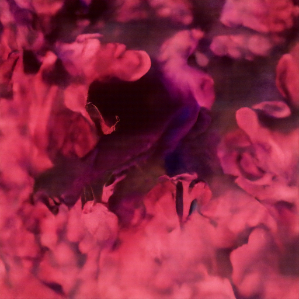

## [](https://github.com/Asad-Ismail/Diffusion_GenerativeModels/issues)[](https://hits.seeyoufarm.com)

# Deep learning based image and Image/Text Generative models

# Denoising Diffusion Implicit Models
On Oxford Flower dataset
Image size 128 x 128
 
 From noise to final images in 200 steps
 
  <p align="center">
    
  </p>
   <p align="center"> 
  
  Final Images @200 step
  
  <p align="center">
    
  </p>
   <p align="center"> 

After training basic diffusion model on flower dataset we will now train the ImageGen diffusion model on small splash dataset with intermediate resolution
## ImageGen
After training ImageGen on unconditional small splash dataset, novel new images generated of intermediate resolution (512 x 512) by imagegen looks like below
 
 
 <p align="center">
  
&nbsp; &nbsp; &nbsp; &nbsp;
  
</p>

 <p align="center">
  
&nbsp; &nbsp; &nbsp; &nbsp;
  
</p>

 <p align="center">
  
&nbsp; &nbsp; &nbsp; &nbsp;
  
</p>

 <p align="center">
  
&nbsp; &nbsp; &nbsp; &nbsp;
  
</p>

  


### References
```
1) @article{Song, Jiaming, Chenlin Meng, and Stefano Ermon. "Denoising diffusion implicit models." arXiv preprint arXiv:2010.02502 (2020)}
